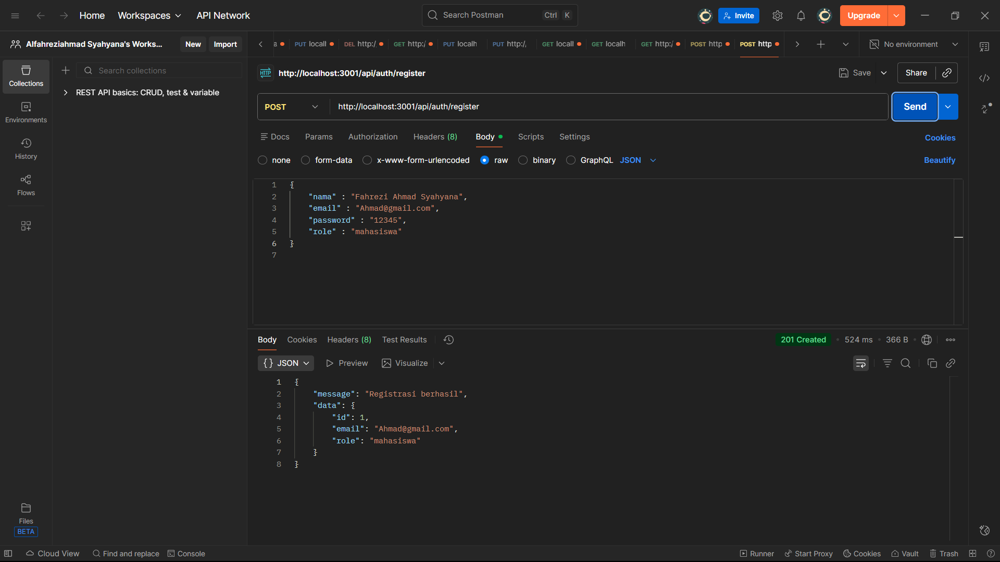
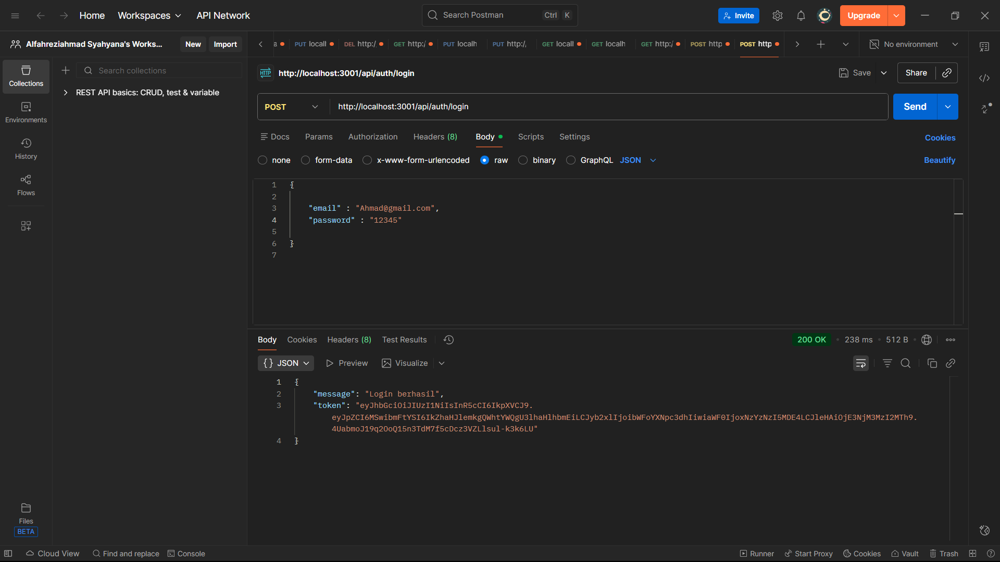
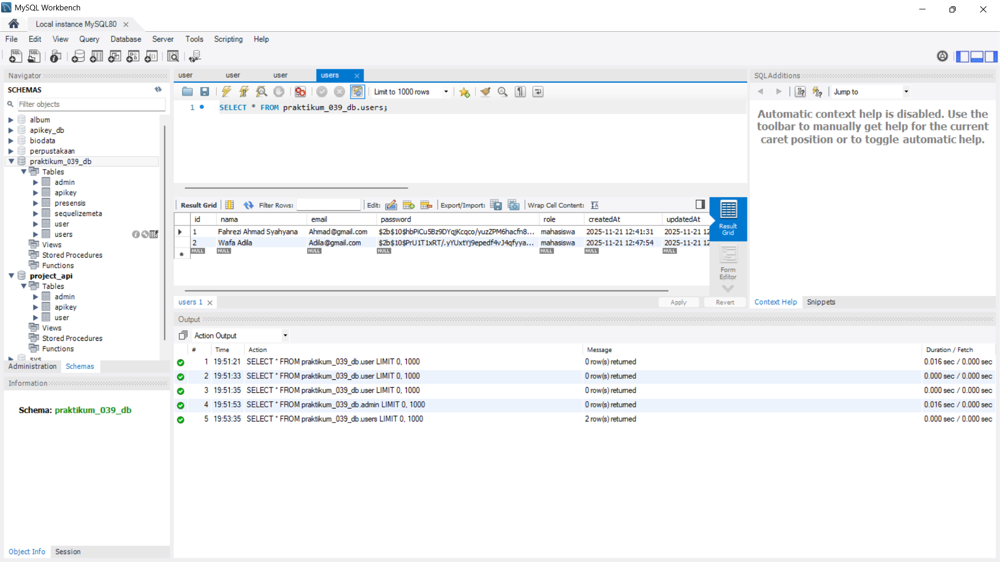

1. Request POST /register (untuk membuat user "mahasiswa")

2. Request POST /register (untuk membuat user "admin").

3.	Request POST /login (login sebagai "mahasiswa" dan mendapatkan token).

4. Database table user
